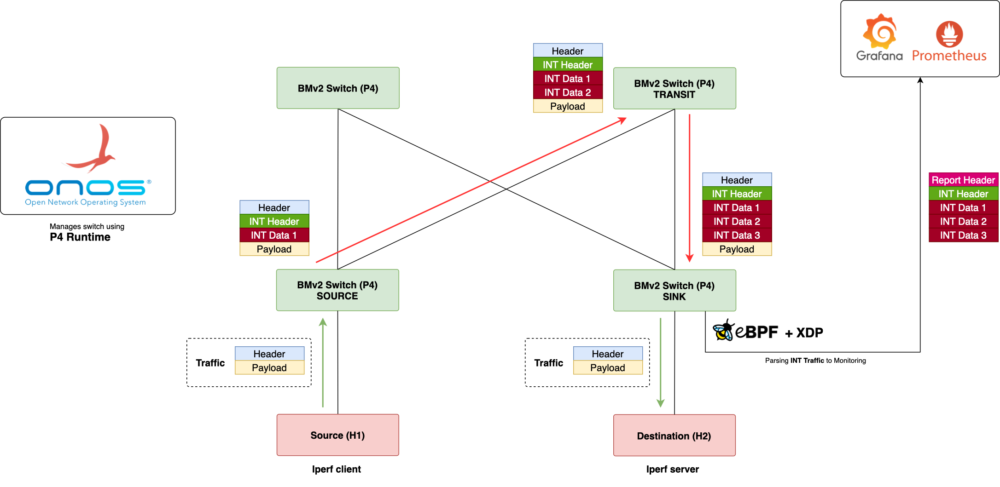

# ONOS-P4-INT
Guide for Lab Practices In-band Network Telemetry based on P4 &amp; P4Runtime together using ONOS

### Detail Lab Diagram

### Lab Installation & Guide
This repo only for file, for detail lab guide you can check to my website documentation

https://luthfi.dev/posts/lab-p4-int-in-band-network-telemetry-with-onos-from-scratch/
